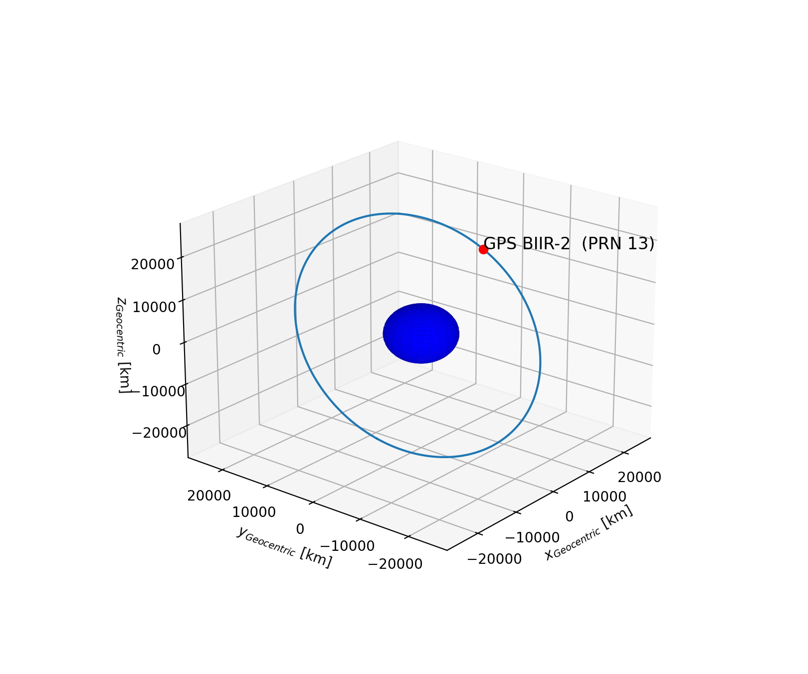

<h2> Description </h2>
This folder contains Python support scripts for the `gnssrolib` library.
The class in `orbit_gnss.py` contains the necessary routines to parse the Two-Line-Element format (TLE) for satellite orbit data.
The module `orbit_graphics` contains functions to plot the corresponding orbits.

<h2> Example </h2>
A demonstration example is given in `main.py` for GPS satellites. 
In order to run the example, type:

```bash
$ python3 main.py
```

The corresponding TLE data is downloaded as a text file from `http://www.celestrak.com/NORAD/elements/`.
The example plot of the orbit will look like this:

<figure></figure>

The human-readable output of the downloaded TLE data looks like this:

```bash
----------------------------------------------------------------------------------------
GPS BIIR-2  (PRN 13)    
1 24876U 97035A   22037.73434940  .00000020  00000+0  00000+0 0  9999
2 24876  55.4949 160.7731 0056178  53.8464 306.6511  2.00563337180030
----------------------------------------------------------------------------------------
````